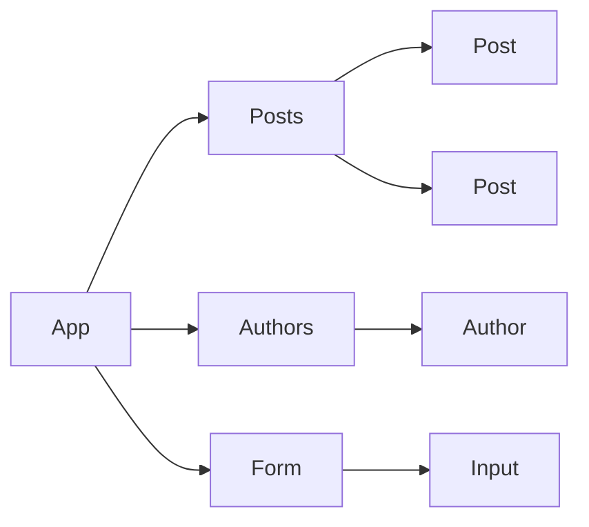
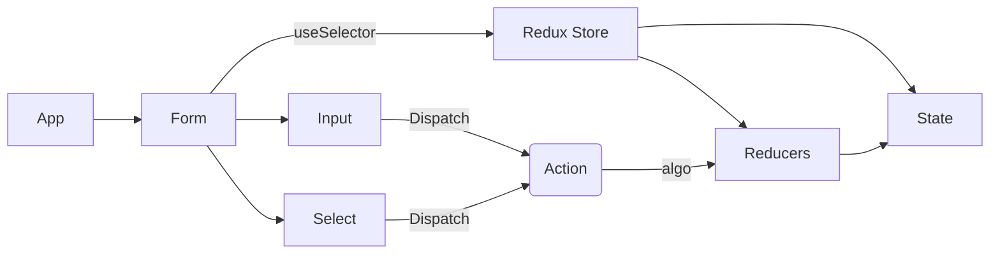

# L'architecture par composant

L'architecture par composant est un paradigme de conception où les systèmes logiciels sont construits en assemblant des composants réutilisables

👍 L'architecture par composant est souvent mise en œuvre à travers des frameworks (Angular) ou des bibliothèques librairies ( React ) qui facilitent la création d'interfaces utilisateur modulaires et réutilisables.

## Résumés des points importants de cette architecture par composant

1. **Modularité** : L'architecture par composant encourage la division de l'interface utilisateur en composants autonomes et réutilisables. Chaque composant est responsable d'une partie spécifique de l'interface utilisateur et est réutilisable.

2. **Indépendance** : Les composants sont conçus pour être indépendants les uns des autres autant que possible. Cela signifie qu'ils peuvent être développés, testés et maintenus séparément, ce qui facilite la gestion de la complexité et encourage la réutilisation du code.

3. **Composition** : Les interfaces utilisateur sont construites en assemblant des composants plus petits pour former des structures plus complexes. Cette approche permet de créer des interfaces utilisateur flexibles et évolutives, où chaque composant peut être facilement remplacé ou mis à jour sans affecter les autres parties de l'application.

4. **Réutilisabilité** : L'un des principaux avantages de l'architecture par composant est la réutilisabilité des composants. Une fois qu'un composant est développé, testé et validé, il peut être réutilisé dans différentes parties de l'application ou d'autre application.

5. **Encapsulation** : Les composants encapsulent à la fois la structure et le comportement de l'interface utilisateur. Cela signifie que les détails de mise en œuvre sont cachés à l'extérieur du composant, ce qui favorise la cohésion et réduit le couplage entre les différents composants de l'application. Cette encapsulation inclut également la gestion de l'état local du composant(par un redux ou un contexte API).

6. **Gestion des données avec les reducers** : Dans le contexte de l'architecture par composant, la gestion des données est souvent réalisée avec des reducers. Les reducers sont des fonctions pures(*) qui spécifient comment l'état de l'application change en réponse à une action donnée. Ils sont couramment utilisés avec des bibliothèques comme Redux pour gérer l'état global de l'application de manière prévisible et immuable.

7. **Frameworks et bibliothèques** : Pour mettre en œuvre l'architecture par composant dans le développement web, de nombreux frameworks et bibliothèques sont disponibles, tels que React, Angular, Vue.js, et bien d'autres. Ces outils fournissent des fonctionnalités et des abstractions pour faciliter la création, la gestion et la réutilisation des composants dans les applications web. Ils incluent souvent des fonctionnalités spécifiques pour la gestion de l'état global, comme Redux dans le cas de React.

(*) 🤖 C'est quoi une fonction pure ...

Une fonction pure est une fonction qui produit toujours la même sortie pour la même entrée et qui n'a pas d'effets de bord observables. Cela signifie que l'évaluation d'une fonction pure ne modifie pas l'état externe du programme et ne dépend que de ses arguments d'entrée pour calculer sa sortie (toujours).

Exemple de fonction pure

```js
// Fonction pure qui additionne deux nombres
function add(a, b) {
  return a + b;
}

// Appel de la fonction pure
console.log(add(3, 5)); // Sortie attendue : 8
console.log(add(3, 5)); // Sortie attendue : 8 (toujours la même sortie pour les mêmes entrées)
```

Dans cet exemple, la fonction `add` est une fonction pure car elle prend deux nombres en entrée (`a` et `b`) et retourne leur somme. Peu importe combien de fois vous appelez cette fonction avec les mêmes arguments, vous obtiendrez toujours le même résultat. De plus, cette fonction ne modifie pas l'état externe du programme ni ne dépend de l'état externe pour produire sa sortie, ce qui la rend pure.

Dans l'exemple suivant la fonction n'est pas pure 

```js
let s = 0 ;
function add(a, b) {
  return a + b + s;
}

// Appel de la fonction pure
console.log(add(3, 5)); // Sortie attendue : 8
s = 10 
// mutable
console.log(add(3, 5)); // Sortie 18 
```

## Ce qu'il faut retenir

🚀 **L'approche par composant** est une méthode de conception où les systèmes logiciels sont construits en assemblant des éléments autonomes et réutilisables appelés composants. 

Ces composants représentent des **unités fonctionnelles** ou **visuelles spécifiques** de l'application. 

L'approche par composant favorise : la modularité, l'indépendance, la réutilisabilité et la maintenabilité du code en permettant une séparation claire des préoccupations. 

Les composants peuvent être développés, testés et déployés individuellement, ce qui facilite la gestion de la complexité et encourage la réutilisation du code. 

Cette approche est largement utilisée dans le développement de logiciels, notamment dans les domaines tels que le développement web (par exemple, React, Angular, Vue.js), comme dans le développement d'interfaces utilisateur graphiques (GUI).

## Example avec React

Voici un schéma Mermaid illustrant de manière concise l'approche par composant :



Dans ce schéma :

- **Application** représente l'ensemble de l'application.

- Chaque composant peut être composé de plusieurs sous-composants, comme illustré par les flèches pointant.

Cela illustre comment l'application est structurée en utilisant une approche par composant, où les composants sont les éléments de base qui composent l'interface utilisateur ou la logique fonctionnelle de l'application.



## Une organistion possible en se basant sur l'architecture en composant 


```txt
src/
│
├── app/
│   ├── App.js
│   └── store.js
│
├── features/
│   ├── counter/
│   │   ├── Counter.js
│   │   └── counterSlice.js
│   │
│   └── todo/
│       ├── TodoList.js
│       └── todoSlice.js
│
├── layouts/
│   ├── MainLayout.js
│   └── AuthLayout.js
│
├── components/
│   ├── Header.js
│   └── Footer.js
│
└── services/
    └── api.js
```